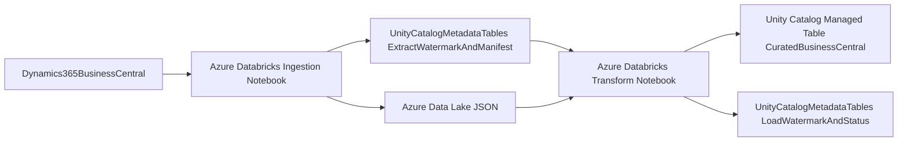

# Business Central to Databricks Incremental Ingestion (3 Notebooks)

This project contains three Databricks notebooks that ingest data from Dynamics 365
Business Central (BC) into Unity Catalog managed Delta tables using a two-step,
incremental pattern:

1. Dump incremental extracts as raw JSON into a Unity Catalog Volume
2. Read that raw JSON and merge it into Unity Catalog managed Delta tables

Notebook paths:

- `notebooks/discover_business_central_entities.py` (Step 0: discover entities and build selection list)
- `notebooks/ingest_business_central.py` (Step 1: BC -> raw JSON in UC Volume)
- `notebooks/load_business_central_raw_to_uc.py` (Step 2: raw JSON -> UC managed tables)

## What It Does

- Step 0 discovers available BC entities and returns a ready-to-use `entities` JSON list
- Step 1 authenticates to BC via OAuth2 client credentials
- Step 1 extracts incremental data per entity and writes raw JSON by `run_id`
- Step 1 tracks extraction watermark and creates manifest rows with `load_status=PENDING`
- Step 2 reads pending raw files from manifest and merges into managed UC Delta tables
- Step 2 updates manifest load status and load watermark tables
- Both steps include retries and per-entity error isolation

## Architecture Diagram



## Target Tables

For each entity in `entities`, the notebook writes to:

- `{target_catalog}.{target_schema}.bc_<entity>`

Examples:

- `main.business_central.bc_customers`
- `main.business_central.bc_salesorders`

## Metadata Tables

Step 1 tables:

- `{metadata_catalog}.{metadata_schema}._bc_extract_watermarks`
- `{metadata_catalog}.{metadata_schema}._bc_raw_manifest`

Step 2 table:

- `{metadata_catalog}.{metadata_schema}._bc_load_watermarks`

## Raw JSON Volume

Raw extracts are written to:

- `raw_volume_path` widget (default: `/Volumes/main/business_central/bc_raw/raw`)

Per entity and run, files are written under:

- `/Volumes/<catalog>/<schema>/<volume>/.../entity=<entity>/run_id=<run_id>/`

## Widgets - Step 1 (`ingest_business_central.py`)

Set these in Databricks before running:

- `config_file_path` (default: `config/pipeline_config.json`)
- `entities_config_file_path` (default: `config/entities_config.json`)
- `bc_tenant_id` (required)
- `bc_environment` (default: `production`)
- `bc_company_id` (required)
- `bc_client_id` (required)
- `bc_client_secret` (required)

Recommended optional widgets:

- `bc_oauth_scope` (default: `https://api.businesscentral.dynamics.com/.default`)
- `bc_api_version` (default: `v2.0`)
- `metadata_catalog` (default: `main`)
- `metadata_schema` (default: `business_central`)
- `raw_volume_path` (default: `/Volumes/main/business_central/bc_raw/raw`)
- `entities` (JSON or CSV override; default comes from `config/entities_config.json`)
- `page_size` (default: `1000`)
- `request_timeout_seconds` (default: `60`)
- `max_retries` (default: `5`)
- `retry_backoff_seconds` (default: `2`)
- `initial_load_start_utc` (optional ISO datetime for first load)

## Widgets - Step 0 (`discover_business_central_entities.py`)

- `config_file_path` (default: `config/pipeline_config.json`)
- `entities_config_file_path` (default: `config/entities_config.json`)
- `bc_tenant_id` (required)
- `bc_environment` (default: `production`)
- `bc_company_id` (required)
- `bc_client_id` (required)
- `bc_client_secret` (required)
- `bc_oauth_scope` (default: `https://api.businesscentral.dynamics.com/.default`)
- `bc_api_version` (default: `v2.0`)
- `metadata_catalog` (default: `main`)
- `metadata_schema` (default: `business_central`)
- `include_pattern` (optional regex include filter, e.g. `customer|item`)
- `exclude_pattern` (optional regex exclude filter, e.g. `attachments|pictures`)
- `selected_entities_csv` (optional explicit list, e.g. `customers,items,salesOrders`)
- `write_entities_config` (default: `true`, writes discovered selection to `entities_config_file_path`)

## Widgets - Step 2 (`load_business_central_raw_to_uc.py`)

- `config_file_path` (default: `config/pipeline_config.json`)
- `entities_config_file_path` (default: `config/entities_config.json`)
- `target_catalog` (default: `main`)
- `target_schema` (default: `business_central`)
- `metadata_catalog` (default: `main`)
- `metadata_schema` (default: `business_central`)
- `primary_key_map_json` (JSON override; default comes from `config/entities_config.json`)
- `source_system_name` (default: `dynamics365_business_central`)
- `run_id_filter` (optional, load only one run)
- `max_runs_per_entity` (default: `100`)

## Example Widget Values

Use values similar to the following:

```python
bc_tenant_id = "00000000-0000-0000-0000-000000000000"
bc_environment = "production"
bc_company_id = "00000000-0000-0000-0000-000000000000"
bc_client_id = "00000000-0000-0000-0000-000000000000"
bc_client_secret = "<secret>"
entities_config_file_path = "config/entities_config.json"
metadata_catalog = "main"
metadata_schema = "business_central"
raw_volume_path = "/Volumes/main/business_central/bc_raw/raw"
```

Example Step 2 values:

```python
target_catalog = "main"
target_schema = "business_central"
metadata_catalog = "main"
metadata_schema = "business_central"
entities_config_file_path = "config/entities_config.json"
run_id_filter = ""  # optional
```

## Central Config File

The pipeline supports two config files:

- `config/pipeline_config.json`
- `config/entities_config.json`

- `pipeline_config.json` stores runtime/env settings (credentials, catalogs, retries, etc.).
- `entities_config.json` stores ingestion scope:
  - `entities`
  - `primary_key_map_json`

Step 0 can auto-populate `entities_config.json` with all discovered entities (or filtered selection)
when `write_entities_config=true`.

Each notebook reads config files first, then applies widget values as overrides.

## Run Order / Scheduling

1. Run `notebooks/discover_business_central_entities.py` (Step 0)
2. (Optional) Verify/update `config/entities_config.json`
3. Run `notebooks/ingest_business_central.py` (Step 1)
4. Run `notebooks/load_business_central_raw_to_uc.py` (Step 2)

For production, schedule both notebooks in one Databricks Workflow with Step 2
depending on Step 1 success.

## Notes

- Ensure the Azure app registration has access to the BC APIs.
- Ensure your Databricks principal can create/use UC volume and metadata tables.
- Ensure your Databricks principal can create schema/table objects in the target catalog/schema.
- Ensure your Databricks principal can create/use the UC volume defined by
  `raw_volume_path`.
- If an entity fails, others continue; each notebook fails at end when failures exist,
  which is useful for job alerting.

